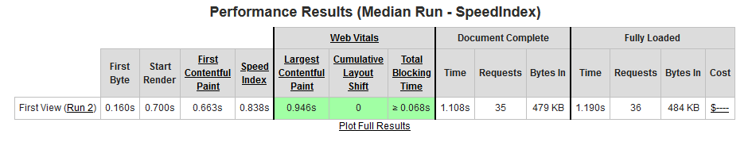

# 十六到二十週心得

## 十六週心得
  這一週學到了 JavaScript 是如何初始化變數、 函式、物件導向以及 event loop 等等，

  看完影片加上做完作業之後，整個覺得超充實的!，尤其是理解了 JavaScript 初始化的過程，
  讓我能夠更容易閱讀程式碼並找出有錯誤的地方；而 event loop 的部份則是讓我了解到 JS 在瀏覽器是如何透過 webAPI 處理事件，
  及 event queue 是如何運作的。
  
  總之，是一堂非常充實的課，如過要再深一點研究的話，可以看
  [You-Dont-Know-JS-第一版](https://github.com/getify/You-Dont-Know-JS/blob/1st-ed/README.md)
  [You-Dont-Know-JS-第二版](https://github.com/getify/You-Dont-Know-JS)
  或是
  [阮一峰的JavaScript 教程](https://wangdoc.com/javascript/index.html)
  [阮一峰的JavaScript ES6 教程](https://wangdoc.com/es6/)

  以上只有看了一點，是我後續要讀的清單，想要對底層運作更熟悉!!

## 十七週心得

本週學習如何運用 Expres 、ORM 套件打造網頁程式並且部署到 heroku。

最令我覺得困難的部份是 ORM 的使用，由於不熟悉，所以在建立 model 時，不知道 model 檔案 及 migration 檔案之間的關連，
所以會導致在改 table columns 時，會發生 model 跟 migration 的 table 資料不一致，造成錯誤，後來才知道，
如果要對已經 migrating 過的 table 欄位做變動，那就應該要建立一個新的 migration 檔案，並在其中寫入要變動的語法，
再進行 db:migrate，讓本地跟 db 資料同步，慢慢熟了之後，就覺得很方便，不用再寫 SQL 語法真的很爽Q

對了，還有就是，由於部落格當初做的比較完整一點，所以改寫成 express 版本花的時間較久，哈哈。

## 十八週心得
  這一週延續17週學到的東西，用寫作業的方式練習熟悉 express 跟 sequelize，這一週作業基本上沒什麼難度，
  所以很快就做完了，在這一週裡更熟悉如何使用 sequelize 以及從 Huli 老師那裡學到了在撈例如商品資料時，
  如果量太大，不適合一次撈出來再過濾自己要的資料，而是一筆一筆去撈。

  另外就是學到如何用 Nginx 去代理 Node apps，讓我成功的用 Docker + nginx + php + node 部署到 AWS 主機上，
  另外也感恩 Huli 老師解答了我關於 Nginx 代理到同 ip 但不同網址的設定問題。

## 十九週心得
本週學到了一些未來工作可能會運用到的工具及流程，例如 agile 敏捷式開發、Scrum 、產品文件撰寫以及 User story 等等

了解到 Scrum 是 agile 敏捷式開發 的一種，透過兩到四週的 Sprint 為一個週期進行開發與檢討，角色有三種，
產品負責人、Scrum 監督以及開發團隊，流程則為，開規劃會議、寫 User story、
根據 User story 寫下實作細節 Tasks、每日立會進度說明及調整進度以及回顧會議。

## 二十週心得

本週基本上我都在玩 18週的超級挑戰題，購物車+串結帳金流，最後成功的建好購物車頁面及串好金流，
雖然購物車頁面目前還不支援 RWD 並且因時間的因素，付款完後的訂單查詢功能沒有做完整，
但終究還是完成超挑題的要求，串金流了開心XD~~剩下的細節可以留待之後有時間再完善吧...現在就先這樣了Q

放上[購物車頁面](https://just-a-bite.mentor4th-john.tw/menu)

* * *

# 網站優化成果

#### 優化後網址

https://chang-ching-chung.github.io/lazy-hackathon/

* * *

#### WebPageTest 報告網址

 [Google PageSpeed Insights](https://developers.google.com/speed/pagespeed/insights)

 行動版分數截圖:
 
 
 電腦版分數截圖
 

 [WebPageTest](https://www.webpagetest.org/)

 截圖:
 

* * *

### 你做了哪些優化？

1. 壓縮圖片，一開始是用 gulp-imagemin 去壓縮圖片，但發現還是太大
，最後換成用 imagemin + imagemin-webp 將圖片全轉成 webp ，
轉換完之後，最大檔案是 415 KB 最小則是 1KB。  

2. 把沒用到的 CSS 刪掉及壓縮，使用的套件為 gulp-purifycss。

3. 把 Jquery, bootstrap, index 等 JS 檔壓縮，使用到的是線上壓縮網站，[JavaScript Minifier](https://javascript-minifier.com/)

4. 刪掉 HTML 裡的註解及沒用到的 CDN 連結，並且壓縮 HTML ，使用的是線上 HTML 壓縮網站[HTML minifier](http://minifycode.com/html-minifier/)

5. 將 CDN 通通加上 defer，讓瀏覽器在 DOM 都解析完再載入 CDN。

6. 使用 Lazy loading 套件，vanilla-lazyload，延遲載入圖片，只有當畫面滾動到有圖片的位置時才載入，使資源可以集中在第一畫面的載入。

通過這樣的優化過程，讓我了解到我的方向沒錯，圖片是最吃資源的，通常只要圖片壓得夠小，就可以大幅減少載入時間，
因此第一時間想到的就是，壓縮圖片、壓縮 JS 及刪除及壓縮 CSS ，這幾個方向之中，
最有用的就是壓縮圖片從 png 轉成 webp 以及 Lazy loading，這兩個做完其實就已經優化的差不多了，
剩下的 CSS 及 JS 壓縮只是錦上添化而已，因為並沒有完全的把無用的 JS 程式碼刪掉QQ

在這裡要跪拜一下大神 [yakim-shu](https://github.com/yakim-shu)，優化報告解說得超級詳細，簡直就是優化聖經了QQ，希望有認識的機會，好好的學一下更多關於網頁優化的技術。